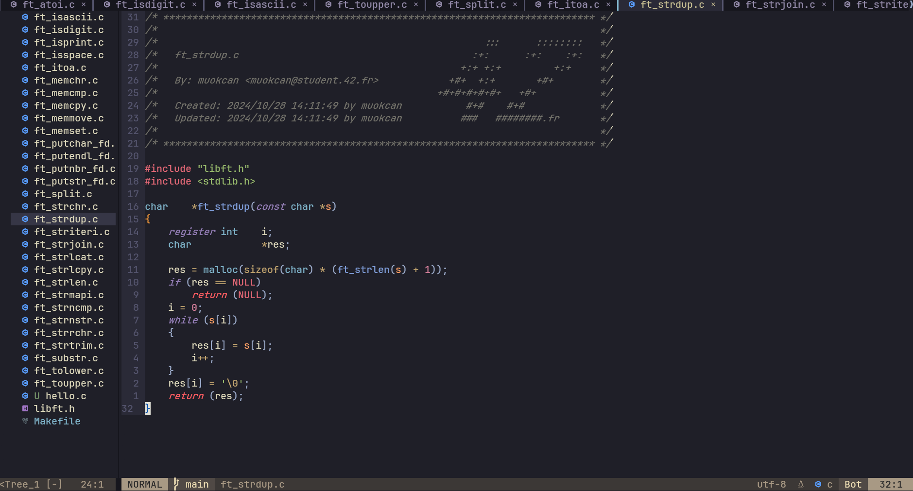

# Neovim Configuration Introduce

If you want to use Neovim at 42, there are some installation issues you might encounter, but don't worry—solutions are available. Below is a step-by-step installation guide for new UbuntuOS.

## Preview 
 

## Getting Started

First download Neovim from 42 Package Manager. When it downloaded you may notice that nvim command doesn't respond. 

**setting up `.bashrc` or `.zshrc`**:

zsh
```bash
echo "alias vim='flatpak run io.neovim.nvim'" >> ~/.zshrc && source ~/.zshrc
```
bash
```zsh
echo "alias vim='flatpak run io.neovim.nvim'" >> ~/.bashrc && source ~/.bashrc
```

## Plugin & Manager Installation

⚠️These plugins and manager require at least free 1.1GB space⚠️

There are some essential plugins that we will use for the default configuration in this guide.

- if you don't have `config/nvim` directory, create one.

- clone this repository's config file into:
```
git clone https://github.com/Etherfiend/NeovimConfigFor42/nvim tmp_nvim && \
mv tmp_nvim .var/app/io.neovim.nvim/config/nvim && rm -rf tmp_nvim
```


We'll use [Packer.nvim](github.com/wbthomason/packer.nvim/tree/master/lua/packer) for managing plugins. While you can use other plugin managers (like Lazy.nvim), this guide focuses on Packer.nvim. As you know we have limited acces and can't reach sudo password. So you need to install Packer.nvim manually.As mentioned, 

**packer.nvim**

- create a directory for packer
```
mkdir -p ~/.config/nvim/pack/packer/start/
```
- clone packer.nvim repository to your into that directory:
```
git clone https://github.com/wbthomason/packer.nvim.git \
    ~/.var/app/io.neovim.nvim/config/nvim/pack/packer/start/packer.nvim/lua/packer
```

**Plugins - Settings**


1 - clone this repository:
```

```
2 - restart neovim and run `:PackerSync` to install/update.

3 - run `:checkhealth` to check the plugin status.

You can also modify setup or init file/files according to your needs. Plugins are essential parts of your neovim experience, feel free to configure them; they won't bite.

## Common Issues

### livegrep
Telescope uses ripgrep(or its alternative) for live_grep function that allows you search/find proccesses within files. You need to install [ripgrep](https://github.com/BurntSushi/ripgrep) to your system to use this feature.
- move the executable to `home/your-username/bin`
- modify related line in init.lua as follows:
```
vim.env.PATH = "/home/your-username/bin:" .. vim.env.PATH
```

### nvim.tree icons
After installing nvim-tree, you may notice that the file tree doesn't display icons properly at first. To fix this, you need to install a [NerdFont](https://www.nerdfonts.com/). However, you can also customize and set your own symbols/characters for the file tree if you prefer.

## Notes

1 - If you want to improve your editor experience beyond the default setup in this guide, you need to understand what Mason and Packer.nvim are, and how they work. Visit their GitHub pages for more information and detailed usage instructions.

2 - 

## Sources

- **wbthomason/packer.nvim**: [GitHub](https://github.com/wbthomason/packer.nvim) _- Plugin manager_
- **morhetz/gruvbox**: [GitHub](https://github.com/morhetz/gruvbox) _- Color theme_
- **nvim-tree/nvim-tree.lua**: [GitHub](https://github.com/nvim-tree/nvim-tree.lua) _- File explorer tree_
- **nvim-tree/nvim-web-devicons**: [GitHub](https://github.com/nvim-tree/nvim-web-devicons) _- File type icons_
- **neovim/nvim-lspconfig**: [GitHub](https://github.com/neovim/nvim-lspconfig) _- LSP configuration_
- **windwp/nvim-autopairs**: [GitHub](https://github.com/windwp/nvim-autopairs) _- Automatic closing of brackets and parentheses_
- **nvim-treesitter/nvim-treesitter**: [GitHub](https://github.com/nvim-treesitter/nvim-treesitter) _- Syntax highlighter_
- **nvim-lualine/lualine.nvim**: [GitHub](https://github.com/nvim-lualine/lualine.nvim) _- Status line_

For the complete list of features and functionalities of these plugins, please visit their GitHub repositories.

